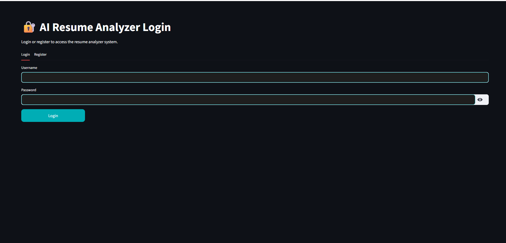
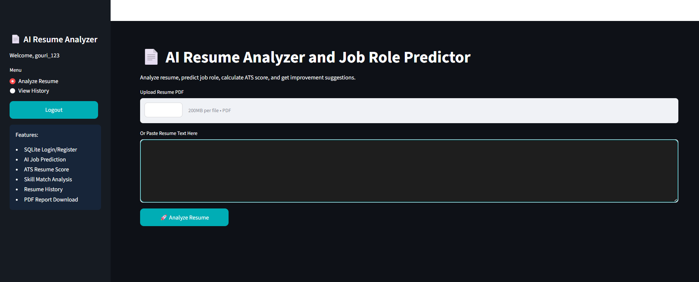
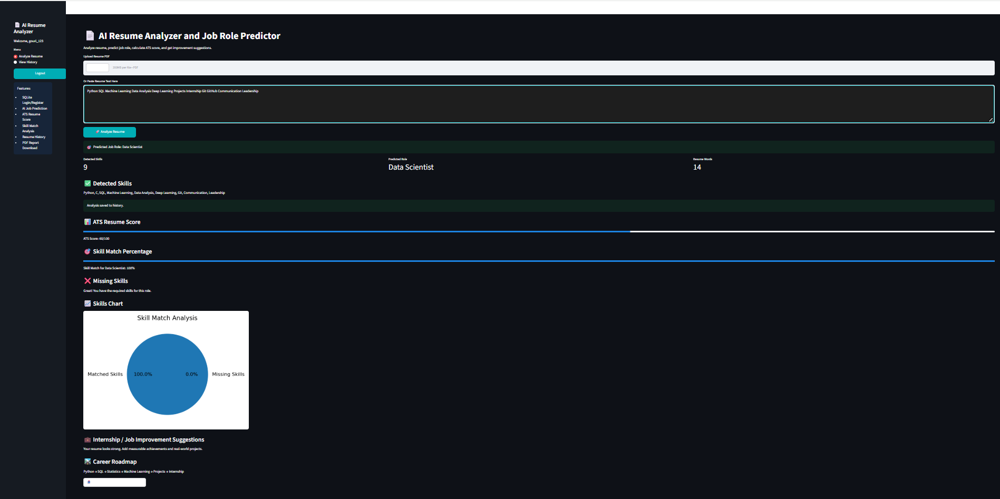

# AI Resume Analyzer

AI Resume Analyzer is a Machine Learning based web application that analyzes resumes and predicts suitable job roles based on skills and resume content.

---

## Features

- Upload Resume PDF
- Resume Text Extraction
- Job Role Prediction
- Skill Analysis
- Machine Learning Integration
- User Friendly Interface

---

## Technologies Used

- Python
- Flask
- Machine Learning
- Scikit-learn
- Pandas
- HTML
- CSS

---

## Project Structure

```bash
AI_Resume_Analyzer/
│
├── app.py
├── train_model.py
├── model.pkl
├── vectorizer.pkl
├── resume_dataset.csv
├── requirements.txt
├── README.md
│
├── templates/
├── static/
└── screenshots/
```

---

## Installation

### 1. Clone Repository

```bash
git clone https://github.com/gkalgurki-design/AI_Resume_Analyzer.git
```

### 2. Open Project Folder

```bash
cd AI_Resume_Analyzer
```

### 3. Install Required Libraries

```bash
pip install -r requirements.txt
```

### 4. Run Application

```bash
python app.py
```

---

## Screenshots

### Home Page



---

### Resume Upload Page



---

### Prediction Result



---

## Future Improvements

- Better UI Design
- Deep Learning Integration
- More Accurate Predictions
- Multiple Resume Format Support
- AI Career Suggestions

---

## Applications

- Recruitment Systems
- HR Automation
- Resume Screening
- Career Guidance
- Job Recommendation Systems

---

## Author

### Gouri Kalgurki

Computer Science Engineering Student  
Machine Learning Enthusiast

---

## GitHub Repository

GitHub Link:

https://github.com/gkalgurki-design/AI_Resume_Analyzer